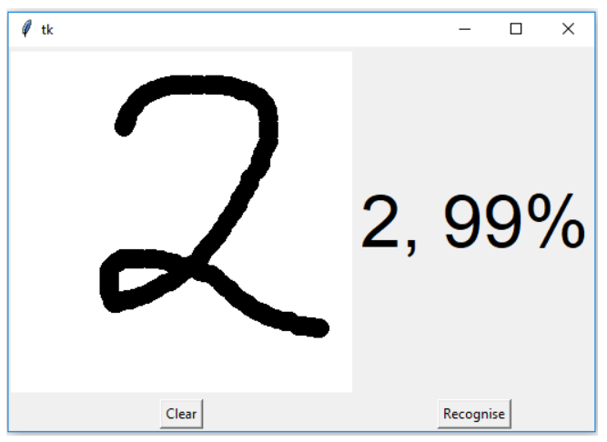
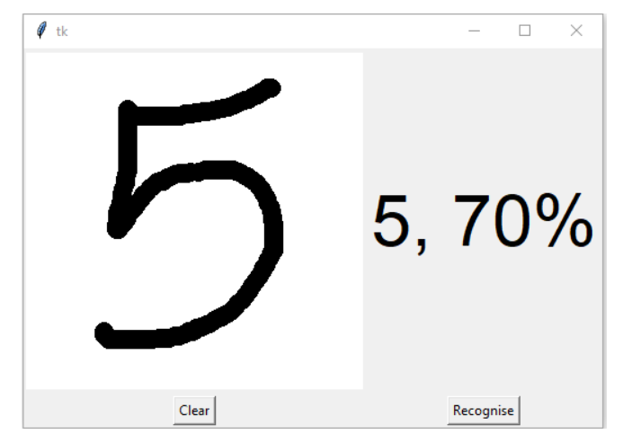

# Handwritten Digit Recognizer

This is a simple Python project that lets you draw digits and recognizes them using a trained deep learning model (CNN).

## 📦 Files
- `gui_digit_recognizer.py` – For drawing and predicting
- `train_digit_recognizer.py` – To train the model
- `mnist.h5` – The trained model

## ▶️ How to Run

1. Open Command Prompt in the folder
2. Install required libraries:
3. Start the app:

## ✅ Requirements
- TensorFlow
- Keras
- NumPy
- Pillow
- PyWin32 (for Windows only)

## 📌 Note
This project runs only on Windows (because it uses `ImageGrab` and `win32gui`).

## 📷 Screenshots

